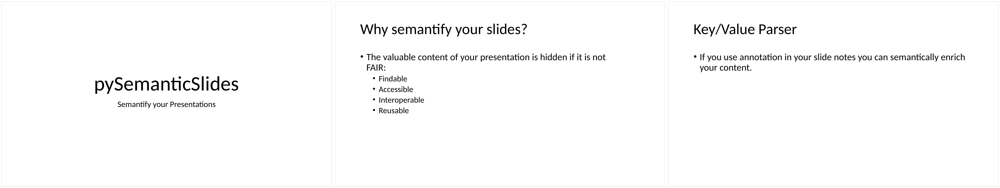

# pySemanticSlides
semantification of slides presentations

[](https://github.com/WolfgangFahl/pySemanticSlides/discussions)
[](https://pypi.org/project/pySemanticSlides/)
[](https://github.com/WolfgangFahl/pySemanticSlides/actions/workflows/build.yml)
[](https://pypi.python.org/pypi/pySemanticSlides/)
[](https://github.com/WolfgangFahl/pySemanticSlides/issues)
[](https://github.com/WolfgangFahl/pySemanticSlides/issues/?q=is%3Aissue+is%3Aclosed)
[](https://WolfgangFahl.github.io/pySemanticSlides/)
[](https://www.apache.org/licenses/LICENSE-2.0)

## Introduction
pySemanticSlides turns a folder of PowerPoint presentations (`.pptx` and
macro-enabled `.pptm`) into a **knowledge graph**. It reads each slide's title,
text runs and notes — including semantic key/value annotations you place in the
slide notes — and emits structured **JSON / CSV / text** or a **Semantic
MediaWiki**.

The goal is to mitigate PowerPoint's long-standing gaps by adding, on top of a
set of presentations and an optional tabular description of semantic links:

* reliable **page numbering** (aware of hidden slides on PDF export)
* **internationalization** — reference slides across language versions
* **indexing** of keywords, publications and persons
* **automation** via [python-pptx](https://pypi.org/project/python-pptx/)
* general **semantic annotations** with arbitrary cross links between slides

### Commands
| command | purpose |
|---------|---------|
| `slidewalker` | walk a folder and extract metadata for all presentations |
| `semslides` | generate a Semantic MediaWiki from the annotated slides |
| `slidebrowser` | interactive slide viewer |
| `slidenames` | list / set slide names |

## Example
The bundled example deck
[examples/semanticslides/SemanticSlides.pptx](examples/semanticslides/SemanticSlides.pptx)
— click the image to open it:

[](examples/semanticslides/SemanticSlides.pptx)

Walking it with `slidewalker`:

```bash
slidewalker --rootPath examples/semanticslides -f json
```

```json
{
  "SemanticSlides.pptx": {
    "title": "pySemanticSlides",
    "author": "Wolfgang Fahl",
    "created": "2023-02-14 06:41:31",
    "path": "examples/semanticslides/SemanticSlides.pptx",
    "slides": [
      {
        "page": 1,
        "pdf_page": 1,
        "title": "pySemanticSlides",
        "text": ["pySemanticSlides", "Semantify your Presentations"],
        "notes": ""
      },
      {
        "page": 2,
        "pdf_page": 2,
        "title": "Why semantify your slides?",
        "notes": "Name: Why_semantify\nTitle: Why semantify your slides?\nKeywords: Semantification, FAIR"
      }
    ]
  }
}
```

The `notes` of slide 2 carry the semantic annotations (`Name`, `Title`,
`Keywords`, ...) that pySemanticSlides parses into the knowledge graph. See the
[wiki](https://wiki.bitplan.com/index.php/PySemanticSlides) for text-run
delimiters, CSV output and the Semantic MediaWiki export.

## Installation
```bash
pip install pySemanticSlides
```

or from source:

```bash
git clone https://github.com/WolfgangFahl/pySemanticSlides
cd pySemanticSlides
pip install .
```

## Docs and Tutorials
[Wiki](https://wiki.bitplan.com/index.php/PySemanticSlides)
